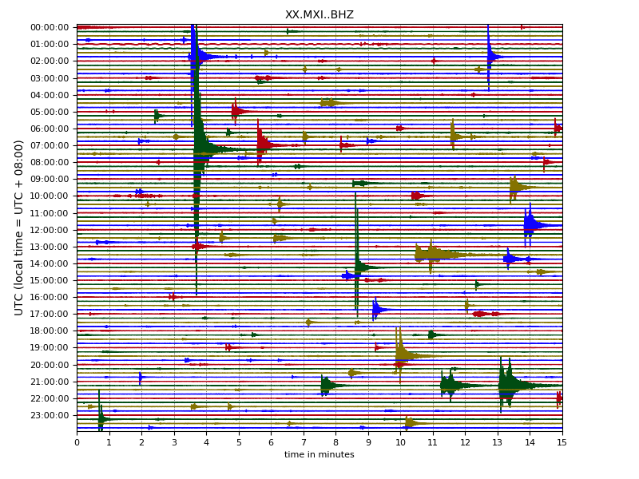
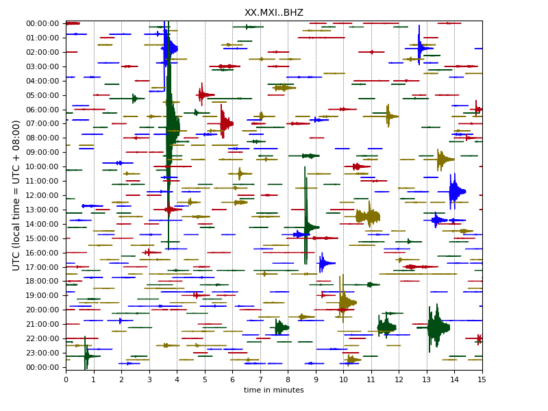
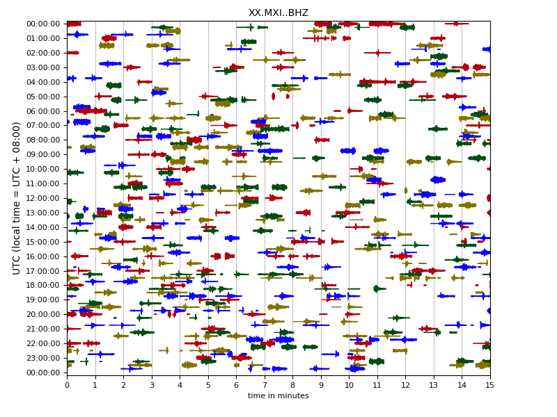

Using ConvNetQuake to train model for events classification based on wenchuan aftershocks
============= 

We use ConvNetQuake to train our own model for events classification based on the wenchuan aftershocks and use it to classify earthquakes from one day continous waveform(2008-07-25) of one station (MXI).

For  ConvNetQuake refer to:
Perol., T, M. Gharbi and M. Denolle. Convolutional Neural Network for Earthquake detection and location. [preprint arXiv:1702.02073](https://arxiv.org/abs/1702.02073), 2017.

## Installation
* Download repository
* Install dependencies: `pip install -r requirements.txt`
* Add directory to python path: `./setpath.sh`

## Data

Our model is trained on data from wenchuan aftershocks. 
Download the [data](https://pan.baidu.com/s/1N_gwRC95qwQHnfNX94cdgQ) (roughly 110 Mb) and symlink to data ln -s data Downloads/data
The continuous waveform data is in ./data

The `data` directory contains:
* `XX.MXI.2008207000000.mseed`: the continious waveform data 
* `dayplot.py`: a script to plot the continious waveform
* `merge_dayplot.py`: a merge script
* `XX.MXI_dayplot_[0-64800].png`: marked earthquakes of the day 

## Trained model

The directory `trained_model` contains:
* `convnetquake`: trained model using over 20000 earthquakes slices (30s) and over 60000 slices of noises (30s)

## Detecting events in continuous waveform data

### From .mseed

./bin/predict_from_stream.py --stream_path data --checkpoint_dir trained_model/ConvNetQuake  --n_clusters 2 --window_size 30 --window_step 31 --output predict_MXI_one_day --plot --save_sac

It will generate a dir "predict_MXI_one_day",which contains:
 
* `viz`: the image of events,the name of the image contain its probility(prob) and its starttime,like "MXI_0.50053_2008-07-25T03_07_18.000000Z.png"
* `viz_not`: the image of noise,notice the  higher prob,the more likely it is an events,actually when the prob>0.1 there is a large chance it is an event. 
* `sac`: the slice data of viz

It proved using overlapping windows will get better results,however,the events will be identified more than once,you can choose the one with highest probility.To run,just uncomment "
#lists = np.arange(0,30,5)
" in predict_from_stream.py

